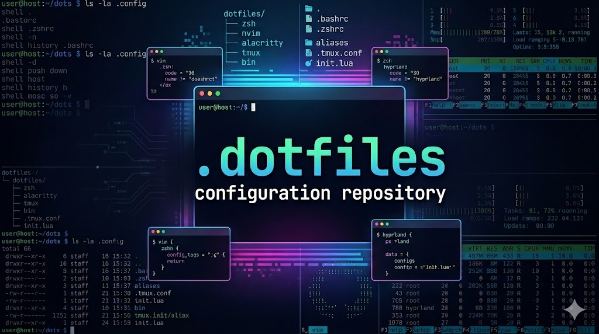

# 

Personal macOS configuration files and setup automation — shell, Git, editors,
CLI tooling, and Claude Code, kept in one place and installed by a single script.

<details>
<summary><strong>Contents</strong></summary>

- [Quick Start](#quick-start)
- [Repository Layout](#repository-layout)
- [What `bootstrap.sh` Does](#what-bootstrapsh-does)
- [External Dependencies](#external-dependencies)
- [Homebrew Packages](#homebrew-packages)
- [Shell Configuration](#shell-configuration)
- [Git Configuration](#git-configuration)
- [Claude Code](#claude-code)
- [Editors](#editors)
- [CLI Tool Configuration](#cli-tool-configuration)
- [macOS Preferences](#macos-preferences)
- [AppleScript and Shortcuts](#applescript-and-shortcuts)
- [Notes and Exclusions](#notes-and-exclusions)
- [License](#license)

</details>

## Quick Start

```bash
cd ~/Downloads/dotfiles
./bootstrap.sh
```

The script resolves its own location, so the repository can live anywhere.

> [!IMPORTANT]
> `bootstrap.sh` uses `sudo` to register shells in `/etc/shells`, write
> `/etc/zshenv`, create directories under `/opt`, and change your login shell
> with `chsh`. It overwrites files in `~`, `~/Library/Preferences`, and
> `~/Library/Developer/Xcode` — it never deletes anything at the destination,
> but it does replace matching files.

## Repository Layout

| Path | Installs To | Contents |
|------|-------------|----------|
| `home/` | `~` | Dotfiles and `~/.config` — zsh, Git, Claude Code, CLI tool configs |
| `xcode/` | `~/Library/Developer/Xcode/` | Code snippets, themes, key bindings, template macros |
| `preferences/` | `~/Library/Preferences/` | Xcode, Terminal, and Script Editor preference plists |
| `Script Libraries/` | `~/Library/Script Libraries/` | Reusable AppleScript libraries (`.scptd`) |
| `BBEdit/` | `~/Library/Application Support/BBEdit/` | Clippings, scripts, text filters, color schemes |
| `shortcuts/` | *(manual import)* | Apple Shortcuts export |
| `brew/` | — | `Brewfile`, `gems.txt`, `python-packages.txt`, `npm-packages.txt`, `gh-extensions.txt` |
| `bootstrap.sh` | — | The installer |

## What `bootstrap.sh` Does

1. Resolves its own directory, so every path below is relative to the repository
   rather than a fixed location.
2. Clears stray `.DS_Store` files, then normalizes file modes (files `600`,
   directories `755`) and puts the execute bit back on the shell and Perl
   scripts, the Git template hooks, and the BBEdit text filters. `.git` is left
   alone.
3. Creates `~/.cache/zsh`.
4. `rsync`s `home/`, `xcode/`, `Script Libraries/`, `BBEdit/`, and
   `preferences/` into their destinations, preserving symlinks and excluding the
   `.gitkeep` placeholders, then restarts `cfprefsd` so the preference plists are
   re-read from disk.
5. Installs Homebrew non-interactively if `brew` is not on `PATH`, then puts it
   on `PATH` for the rest of the run. Aborts if `brew` still is not usable, then
   runs `brew bundle` against [`brew/Brewfile`](brew/Brewfile) and re-checks it
   afterward.
6. Clones [`Gary-Ash/Scripts`](https://github.com/Gary-Ash/Scripts) into
   `/opt/geedbla` if there is no checkout there already. `/opt` is root-owned,
   so the directory is created and handed over with `sudo` before `git` writes
   into it.
7. Downloads the latest [`Gary-Ash/Prompt`](https://github.com/Gary-Ash/Prompt)
   and [`Gary-Ash/StartupBanner`](https://github.com/Gary-Ash/StartupBanner)
   releases and installs the binaries into `/opt/bin`, where `.zshrc` and
   `sysupdate` expect them. A download failure only warns — the shell still comes
   up without them.
8. Registers the Homebrew `bash` and `zsh` in `/etc/shells` and sets zsh as the
   login shell via `chsh`.
9. Creates the language environments the shell config expects — `/opt/venv`
   (root-owned, with an ACL granting the installing user access), the rbenv root
   at `/opt/venv/ruby` with Ruby `4.0.1`, and the Python venv at
   `/opt/venv/python3` built from Homebrew's `python@3.14` — then puts the rbenv
   shims on `PATH` and activates the venv.
10. Installs every gem in [`brew/gems.txt`](brew/gems.txt) and every package in
    [`brew/python-packages.txt`](brew/python-packages.txt) into those environments rather than the system runtimes, then every global in`brew/npm-packages.txt`](brew/npm-packages.txt) into the Homebrew node prefix that `.zshenv` points `NODE_PATH` at, with `NPM_CONFIG_USERCONFIG`pointed at [`home/.config/npm/config`](home/.config/npm/config) so the
    install honors the same npm config the shell does. Finally every extension in
    [`brew/gh-extensions.txt`](brew/gh-extensions.txt) is handed to `gh extension
    install`, one per invocation, under the `XDG_DATA_HOME` `.zshenv` exports.
11. Runs `compaudit` in a zsh subshell — seeded with the same `fpath` entries
    `.zprofile` adds, since `zsh -f` would otherwise not see them — and strips
    group-write from anything it flags, satisfying zsh's completion security
    check.
12. Appends the `ZDOTDIR` / XDG exports to `/etc/zshenv`, so the XDG layout is in
    place before any zsh startup file is read.
13. Opens the Shortcuts import sheet for any `shortcuts/*.shortcut` not already
    in the library.

> [!NOTE]
> Step 9 has to precede step 10. Without it `gem` resolves to `/usr/bin/gem` and
> writes to the SIP-protected system Ruby 2.6, and Homebrew's `pip3` refuses to
> install at all — `error: externally-managed-environment` (PEP 668).

Every step is idempotent — re-running the script is safe.

## External Dependencies

This repo is not self-contained. The following are referenced by the configs but
live elsewhere:

| Dependency | Referenced By | Notes |
|------------|---------------|-------|
| `/opt/geedbla` | `PATH`, `fpath`, Git filters, `update-dotfiles`, `sysupdate` | Script tree from [`Gary-Ash/Scripts`](https://github.com/Gary-Ash/Scripts) — cloned by `bootstrap.sh` |
| `/opt/bin/Prompt` | `.zshrc` prompt hook | Powerline-style prompt binary from [`Gary-Ash/Prompt`](https://github.com/Gary-Ash/Prompt) — latest release installed by `bootstrap.sh` |
| `/opt/bin/startup-banner` | `.zshrc`, `sysupdate` | Terminal banner tool from [`Gary-Ash/StartupBanner`](https://github.com/Gary-Ash/StartupBanner) — latest release installed by `bootstrap.sh` |
| `/opt/venv/ruby`, `/opt/venv/python3` | `.zshenv`, `.zprofile`, `functions.zsh` | `RBENV_ROOT` and the Python venv — created by `bootstrap.sh` |
| Kaleidoscope | Git diff/merge tools, `.lldbinit`, `.pdbrc` | `ksdiff` must be on `PATH` |
| `~/.config/git/allowed_signers` | `gpg.ssh.allowedSignersFile` | Excluded on purpose — see [Notes](#notes-and-exclusions) |

Two directories are `.gitignore`d because they are separate clones:

- `home/.claude/plugins/marketplaces/`
- `home/.claude/skills/github-cli-claude-skill/`

## Homebrew Packages

37 formulae and 1 cask across 4 taps. npm globals are kept separately — see below.

| Category | Packages |
|----------|----------|
| Shell | `zsh`, `bash`, `zsh-autosuggestions`, `zsh-completions`, `zshdb` |
| Git | `git`, `gh`, `git-delta`, `git-lfs`, `libgit2`, `github-mcp-server` |
| Diff / Review | `diffnav`, `tuicr` |
| Search / Navigation | `ripgrep`, `fd`, `television`, `zoxide` |
| File Utilities | `bat`, `eza`, `jq`, `rename`, `imagemagick` |
| Languages | `python@3.14`, `python-packaging`, `node`, `rbenv` |
| Build | `cmake` |
| Swift / Xcode | `swiftformat`, `swiftlint`, `swiftformat-for-xcode` (cask) |
| Formatters / Linters | `shfmt`, `shellcheck`, `perltidy`, `uncrustify` |
| Testing | `bats-core` |
| Misc | `mole`, `sshpass`, `hello` |

Language package manifests, each installed by `bootstrap.sh` rather than by
`brew bundle`: **147** gems (Jekyll, RuboCop, Solargraph, Sorbet, YARD, MCP),
**35** pip packages (Black, pylint, flake8, mypy helpers, `python-lsp-server`,
Rope), **4** npm globals (`@mermaid-js/mermaid-cli`, `bash-language-server`,
`jscpd`, `perlnavigator-server`), and **2** `gh` extensions (`dlvhdr/gh-dash`,
`dlvhdr/gh-enhance`).

## Shell Configuration

Zsh follows the XDG Base Directory spec: `ZDOTDIR` is `~/.config/zsh`, caches go
to `~/.cache`, and the split is by startup phase.

| File | Loaded | Purpose |
|------|--------|---------|
| `.zshenv` | Every shell | XDG vars, locale, `EDITOR`/`VISUAL` (BBEdit), Node, Homebrew, Ruby, tool config paths |
| `.zprofile` | Login shells | `path` and `fpath` ordering, set after `path_helper` so it wins |
| `.zshrc` | Interactive shells | Sources the modules below, completions, key bindings, autosuggestions, zoxide, prompt, banner |
| `options.zsh` | via `.zshrc` | History, globbing, and completion `setopt` flags, `LS_COLORS`, and completion `zstyle`s |
| `aliases.zsh` | via `.zshrc` | Command shortcuts |
| `functions.zsh` | via `.zshrc` | Shell functions |
| `television.zsh` | via `.zshrc` | `tv`-backed path-completion widget and bracketed-paste helpers |

Completions for `npm`, `gh`, and `tv` are generated once and cached under
`$XDG_CACHE_HOME/zsh/completions`, regenerated only when a cache file is
missing, empty, or older than seven days — the shell does not spawn those tools
on every startup.

<details>
<summary><strong>Functions and aliases</strong></summary>

| Name | Kind | Does |
|------|------|------|
| `update-dotfiles` | function | Runs the update script, then `cd`s into this repo |
| `sysupdate` | function | Updates gh extensions, gems, pip, npm, and Homebrew; prunes caches; fixes `/Applications` ownership. Silent unless a command fails |
| `mkwip` / `workdone` | function | Create and tear down `~/Developer/WIP` |
| `mkcd` | function | `mkdir -p` then `z` into it |
| `cdf` | function | `cd` to the Finder insertion location |
| `cdl` | function | `z` into a directory, then long-list it with `eza` |
| `2finder` | function | Close every Finder window and open one centered on `$PWD` |
| `man` | function | Colorized `man` wrapper |
| `cleanhist` | function | Delete the history file and re-exec the login shell |
| `genuuid` | function | Lowercase UUID to the pasteboard with a notification (aliased as `uuid`) |
| `ls` / `ll` | alias | `eza` with icons, Git status, and directory grouping |
| `zshrc` | alias | Open every zsh config in the editor, then `cleanhist` |
| `mute`, `volume*`, `afk`, `fix-finder` | alias | macOS system controls via `osascript` |
| `show-all-files` / `hide-all-files` | alias | Toggle Finder hidden files |
| `perms` | alias | `stat` showing symbolic and octal permissions |
| `recordSimulator` | alias | `xcrun simctl io booted recordVideo` |

</details>

## Git Configuration

`~/.gitconfig` holds only identity and the `diffnav` pager; the substance is in
`~/.config/git/config`.

- **Signing** — SSH-format commit and tag signing with `~/.ssh/id_ed25519.pub`,
  `commit.gpgsign` and `tag.gpgsign` both on.
- **Pager** — `delta`, side-by-side, line numbers, Solarized dark syntax theme.
- **Diff / merge tools** — Kaleidoscope (`ksdiff`), `zdiff3` conflict style,
  `rerere` enabled with autoupdate.
- **Colors** — full Solarized palette for log graph, decorations, diff, and status.
- **Safety** — `pull.ff = only`, `push.default = simple` with `autoSetupRemote`,
  and `pushf` aliased to `--force-with-lease`.
- **Maintenance** — commit-graph writing on `fetch` and `gc`, prune on fetch,
  submodule recursion.
- **Aliases** — `unstage`, `amend`, `oops`, `discard`, `delete-merged`, `trim`,
  `pruner`, `co-author`, and an explicitly named `nuke` that prompts first.
- **Filters** — `lfs`, plus `plist` and `applescript` clean/smudge filters, with
  `textconv` for AppleScript, UTF-16, plists, and binaries.
- **URL shorthands** — `gh:` and `gist:`.

`init.templateDir` points at `~/.config/git/template`, so every new repository
gets two hooks:

| Hook | Language | Behavior |
|------|----------|----------|
| `pre-commit` | Bash | Delegates to `pre-commit.d/format-source.sh`, which runs `swiftformat` on Swift and `uncrustify` on C/C++/Objective-C/Java staged files |
| `commit-msg` | Perl | Enforces the 72-column convention and the `[BUG FIX]` / `[FEATURE]` / `[REFACTOR]` / `[TEST CODE]` / `[TIDY]` tags, reopening the editor (up to 5 attempts) so a bad message can be repaired in place |

## Claude Code

Everything under `home/.claude/`.

- **`CLAUDE.md`** — global guidelines: TDD Kent Beck style, Tidy First, Swift
  primary (SPM + swift-testing), Python 3.10+ stdlib-only, C++20 with CMake and
  sanitizers, plus scope, tone, and answer-format rules.
- **`settings.json`** — Opus model, fullscreen TUI, empty commit/PR attribution,
  a Perl status line, and a `Bash`/`Skill` permission allowlist.
- **`statusline.pl`** — status bar rendering model, cost, context-window usage,
  and rate-limit bars from the JSON on stdin.
- **`mcp.json`** — the [sosumi.ai](https://sosumi.ai) MCP server (Apple developer
  documentation).
- **`github-mcp-wrapper.sh`** — launches `github-mcp-server` read-only with a
  token pulled from the macOS Keychain via `gh auth token`, so no PAT is written
  to a config file.

### Skills

| Skill | Purpose |
|-------|---------|
| `applescript` | AppleScript authoring, compiling, and System Events automation |
| `bash` | Bash script scaffolding, execution, debugging |
| `cpp` | Modern C++ with memory-safe idioms and cross-platform CMake |
| `perl` | Perl scripts and modules |
| `python3` | Python scripts and packages |
| `file-header` | Consistent metadata headers with correct comment syntax per language |
| `commit` | Commit messages following the tag and Title Case conventions |
| `github-cli` | `gh` workflows for issues, PRs, releases *(separate clone)* |
| `discovery-tree` | Mermaid Discovery Tree task visualization |

### Plugins

| Plugin | Marketplace |
|--------|-------------|
| `swift-lsp`, `clangd-lsp` | `anthropics/claude-plugins-official` |
| `swift-concurrency` | `AvdLee/Swift-Concurrency-Agent-Skill` |
| `swiftui-expert` | `AvdLee/SwiftUI-Agent-Skill` |

The Swift Concurrency and SwiftUI reference material is also vendored under
`home/.config/agents/skills/` for use outside Claude Code.

## Editors

### BBEdit

The `BBEdit/` tree mirrors the Application Support folder.

| Folder | Contents |
|--------|----------|
| `Clippings/` | 174 snippets across C/C++, JavaScript, Perl, Python, Ruby, Shell, Swift |
| `Text Filters/` | 8 filters — align assignments, align into columns, and format JSON, Perl, Python, Shell, Swift |
| `Scripts/` | Box/heading/line comment builders, Smart New Line, license templates |
| `Attachment Scripts/` | `documentWillSave` and `applicationWillSwitchOut` handlers |
| `Language Modules/` | ARM64 assembly, ARM64 `objdump`, Zig |
| `Color Schemes/` | Solarized Dark and Light |
| `Setup/` | Preferences backup, menu shortcuts, grep patterns, enabled clipping sets |

### Xcode

| Path | Contents |
|------|----------|
| `UserData/CodeSnippets/` | 56 snippets, mostly Swift/SwiftUI/UIKit |
| `UserData/FontAndColorThemes/` | Solarized Dark and Light |
| `UserData/KeyBindings/` | `Default.idekeybindings` |
| `UserData/IDETemplateMacros.plist` | File header template macros |
| `UserData/xcdebugger/` | Shared breakpoints |

## CLI Tool Configuration

| Tool | Config | Highlights |
|------|--------|------------|
| `television` | `.config/television/` | 44 cable channels — Git (log, branches, stash, worktrees, reflog), `gh` issues/PRs, brew/npm/pip packages, launchd, procs, man pages, history |
| `bat` | `.config/bat/config` | Solarized dark, italics, zsh and Brewfile syntax mapping |
| `eza` | `.config/eza/theme.yml` | Full Solarized theme for file kinds, permissions, and Git status |
| `ripgrep` | `.config/rgrc.conf` | Solarized colors, hidden files, smart case, and Apple-specific types (`ib`, `strings`, `xcconfig`, `plist`, `modulemap`, `swiftinterface`) |
| `tuicr` | `.config/tuicr/config.toml` | Side-by-side review, Solarized light/dark following the system, custom comment types |
| `diffnav` | `.config/diffnav/config.yml` | Side-by-side, 30-column file tree, Nerd Font status icons |
| `gh`, `gh-dash` | `.config/gh/`, `.config/gh-dash/` | CLI and dashboard settings |
| `swiftformat` | `.config/.swiftformat` | Swift 6 mode, 4-space tabs, `--self remove`, organized declarations by visibility |
| `black`, `pycodestyle` | `.config/black`, `.config/pycodestyle` | 200-column lines |
| `perltidy`, `uncrustify` | `.config/.perltidyrc`, `.config/.uncrustify` | Perl and C-family formatting |
| `sourcekit-lsp` | `.config/sourcekit-lsp/config.json` | Background indexing and preparation |
| `solargraph` | `.config/.solargraph.yml` | Ruby language server |
| `npm` | `.config/npm/config` | Cache redirected to `~/.cache/npm` |
| `mole` | `.config/mole/purge_paths` | Directories `mo purge` is allowed to scan |

Also included: `.lldbinit` and `.pdbrc` (Kaleidoscope integration for LLDB and
pdb), `.hushlogin`, and an `.ssh/config` that enables `AddKeysToAgent` and
`UseKeychain`.

## macOS Preferences

Three plists are copied into `~/Library/Preferences`:

- `com.apple.dt.Xcode.plist`
- `com.apple.Terminal.plist`
- `com.apple.applescript.plist`

> [!NOTE]
> `cfprefsd` caches preference domains in memory, so `bootstrap.sh` restarts it
> after copying these in. That is not enough on its own for an app that is
> running — it holds its own copy and writes it back on quit — so close Xcode and
> Terminal before bootstrapping.

## AppleScript and Shortcuts

`Script Libraries/` holds three script bundles installed to
`~/Library/Script Libraries` and loadable with `use script "…"`:

| Library | Provides |
|---------|----------|
| `BBEditUtilities.scptd` | BBEdit document and selection helpers |
| `TextUtilities.scptd` | String and text manipulation |
| `HashTable.scptd` | Associative-array implementation |

`shortcuts/Gee Dbl A Toolbox.shortcut` is an Apple Shortcuts export, already
signed in the `AEA1` format. `bootstrap.sh` opens it on a machine that does not
have it yet; confirming the import sheet is a manual step — see
[Notes and Exclusions](#notes-and-exclusions).

## Notes and Exclusions

`shortcuts` has `run`, `list`, `view`, and `sign` but no import verb, and the
Shortcuts scripting dictionary exposes only `run` — there is no headless way to
add a shortcut to the library. `bootstrap.sh` gets as close as macOS allows: for
each `shortcuts/*.shortcut` whose name is not already in `shortcuts list`, it
opens the file so Shortcuts raises its import sheet, which you then confirm.
Shortcuts already installed are skipped, so re-running is quiet.

Two files are excluded from the repository on purpose:

- **`~/.config/git/allowed_signers`** — pins a public key to an identity, so it
  is restored from a private backup rather than committed. Without it,
  `git log --show-signature` warns; drop the `allowedSignersFile` line or supply
  your own file to silence it.
- **`home/.claude/mcp-needs-auth-cache.json`** — reveals which MCP services have
  been authenticated.

## Author

Gary Ash <gary.ash@icloud.com>

## License

MIT License — see [LICENSE.md](LICENSE.md).
